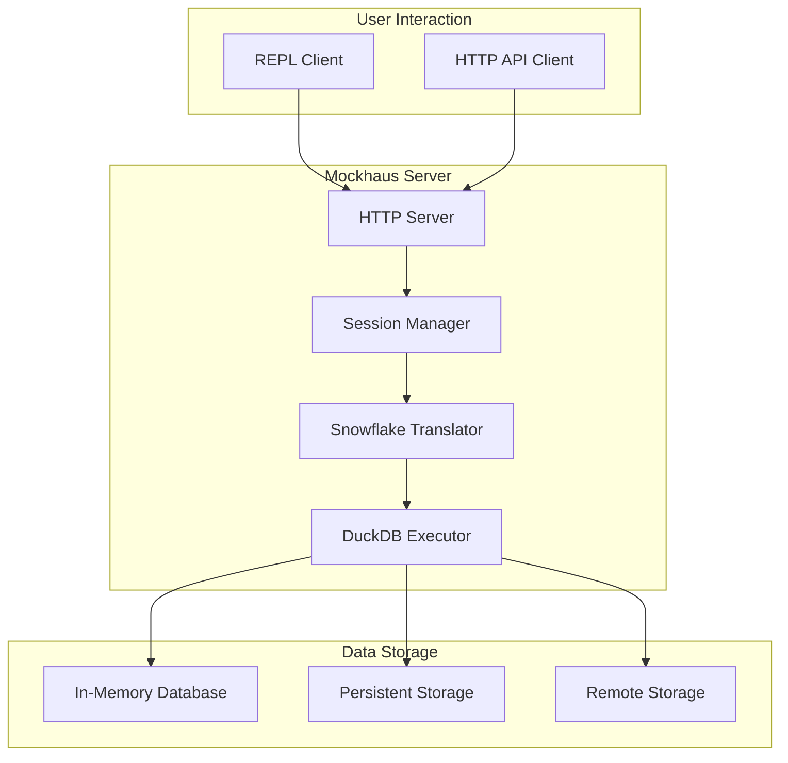
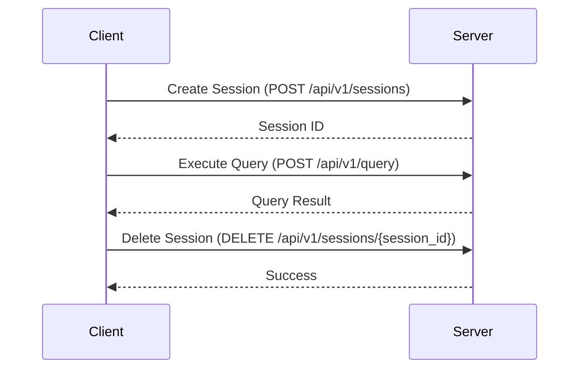
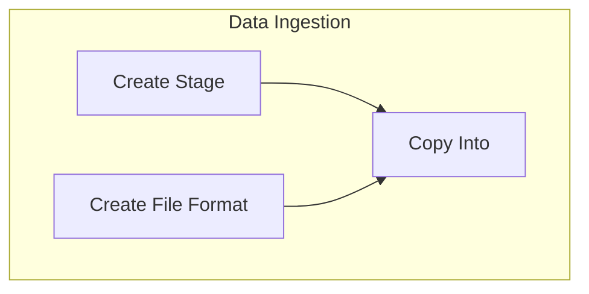
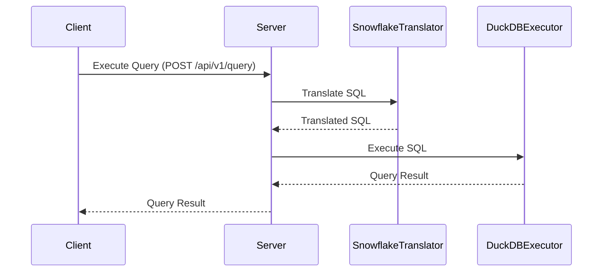

# System Design

This document outlines the architecture and design of Mockhaus, a Snowflake proxy that uses DuckDB as a backend.

## High-Level Architecture

The following diagram illustrates the high-level architecture of Mockhaus:

### Components

*   **REPL Client:** An interactive command-line interface for sending queries to the Mockhaus server.
*   **HTTP API Client:** Any client that can send HTTP requests to the Mockhaus server (e.g., `curl`, Python `requests`).
*   **HTTP Server:** A FastAPI server that exposes a REST API for session management and query execution.
*   **Session Manager:** Manages user sessions, including creating, deleting, and tracking active sessions. It supports both in-memory and persistent sessions.
*   **Snowflake Translator:** Translates Snowflake SQL queries to DuckDB SQL. It uses `sqlglot` for parsing and translation.
*   **DuckDB Executor:** Executes the translated DuckDB SQL queries using the DuckDB engine.
*   **In-Memory Database:** A DuckDB database that is stored in memory. Used for in-memory sessions.
*   **Persistent Storage:** A DuckDB database that is stored on disk. Used for persistent sessions.
*   **Remote Storage:** Remote storage for data ingestion (e.g., S3, GCS, Azure Blob Storage).

## Session Management

Mockhaus supports multiple user sessions, each with its own isolated DuckDB database instance. This allows users to work with different datasets and schemas without interfering with each other.

### Session Types

*   **In-Memory Sessions:** Sessions that are stored in memory. They are fast but not persistent. When the server is restarted, all in-memory sessions are lost.
*   **Persistent Sessions:** Sessions that are stored on disk. They are slower than in-memory sessions but are persistent across server restarts.

### Session Lifecycle

The following diagram illustrates the lifecycle of a session:

## Data Ingestion

Mockhaus supports data ingestion from remote storage using the `COPY INTO` command. The data ingestion workflow is as follows:

1.  **Create a Stage:** A stage is a reference to a remote storage location (e.g., S3 bucket, GCS bucket).
2.  **Create a File Format:** A file format describes the format of the data files (e.g., CSV, JSON, Parquet).
3.  **Copy Data:** The `COPY INTO` command copies data from the stage into a table.

The following diagram illustrates the data ingestion workflow:

## Query Execution

The following diagram illustrates the sequence of events when a query is executed:

